# MarketTwin AI – Real-Time Customer Intelligence & Omnichannel Marketing Orchestration Platform

## Overview
MarketTwin AI is an advanced, real-time marketing orchestration platform that builds digital customer twins by observing ecommerce behaviors across channels. By unifying customer identity and tracking real-time intent, fatigue, and conversion probabilities, the AI-driven Next-Best-Action (NBA) engine automatically selects the optimal communication channel and message while strictly adhering to user consent and channel policies.

## Problem Statement
Modern ecommerce marketing suffers from a lack of real-time intelligence:
- **Fragmented Customer Identity**: Interactions across devices remain siloed, preventing a unified view of the customer.
- **Cart Abandonment**: High bounce rates persist because re-engagement is either too slow or contextually irrelevant.
- **Wrong Channel Targeting**: Blasting the same message across all channels leads to wasted ad spend and **Customer Fatigue**.
- **Lack of AI Explainability**: Marketers cannot understand *why* an AI selected a specific action or skipped a channel.
- **Difficulty Measuring Impact**: Connecting a specific push notification or email to a final conversion remains an attribution challenge.

## Solution
MarketTwin AI solves this by introducing a closed-loop intelligence architecture:
- **Unified Identity Resolution**: Instantly resolves cross-device behavior into a single Global Customer ID.
- **Real-Time Event Stream**: Captures interactions (e.g., product views, cart actions) as they happen.
- **Digital Customer Twin**: Maintains a live, evolving profile of customer affinities, intent scores, and fatigue levels.
- **Intent/Churn/Fatigue Scoring**: Continuously recalculates conversion probability and churn risk.
- **AI Orchestration & NBA Engine**: Decides the exact Next Best Action to take based on the digital twin's current state.
- **Policy-Aware Channel Routing**: Enforces strict governance, skipping channels like WhatsApp if explicit consent is missing.
- **Measurement and ROI Tracking**: Closes the loop by directly attributing recovered carts and revenue to the specific AI-driven intervention.

## Hackathon Theme Alignment
MarketTwin AI strongly aligns with themes around **AI-powered customer experience**, **intelligent marketing automation**, **personalization**, **customer data platforms**, **digital transformation**, and **business impact analytics**. It showcases how predictive AI can transition marketing from a batch-and-blast model to an individualized, real-time orchestration strategy.

## Key Features
- **Real-time Command Center**: Live oversight of system throughput, active twins, and AI decisions.
- **Global Identity Map**: Visualizes the deterministic linking of devices and sessions to human profiles.
- **Digital Customer Twin**: Deep dive into individual customer intent, lifecycle stage, and affinities.
- **AI Orchestration Engine**: The brain that evaluates multi-channel eligibility and calculates the optimal NBA.
- **Audience Intelligence**: Macro-level insights into fatigue distribution and segment health.
- **Storefront Simulator**: A live demo environment to generate user events.
- **Email Deliverability**: Simulated inbox to view generated email content.
- **WhatsApp Policy Gate**: Simulated WhatsApp gateway highlighting consent enforcement.
- **SMS/Push Rejection Logic**: Engine demonstrating why certain channels are rejected (e.g., fatigue risk).
- **Measurement Dashboard**: ROI and attribution tracking comparing baseline metrics vs. AI-uplift.
- **Presentation Mode / Run Demo**: Automated scenario execution to present the end-to-end value proposition.

## System Architecture

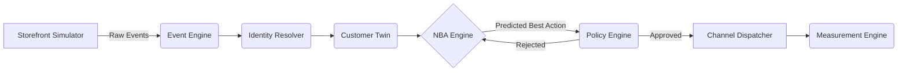

## AI Explainability
MarketTwin AI operates transparently. For every decision, the system exposes:
- **Current Conversion Probability**: The baseline likelihood of purchase before intervention.
- **NBA Confidence**: The AI's confidence in the chosen next best action.
- **Projected Conversion Probability**: The expected likelihood of purchase *after* the intervention.
- **Channel Routing Logic**:
  - *Why WhatsApp was skipped*: Explains if the rejection was due to missing user consent or policy restrictions.
  - *Why Email was used as fallback*: Details the channel cycling logic when a primary channel is blocked.
  - *Why SMS/Push was rejected*: Exposes threshold limitations, such as low channel affinity or high customer fatigue risk.

## Demo Scenario
**The John Doe (CUST_007) Cart Abandonment Story**

1. **Source Channel**: John browses the website and abandons his cart containing a high-value item.
2. **Event Captured & Identity Resolved**: The system captures the event, linking the anonymous session to John Doe.
3. **Customer Twin Updated**: John's intent score spikes, but his fatigue score is evaluated.
4. **AI Orchestration**: The NBA engine predicts the highest conversion probability by sending a recovery coupon via WhatsApp.
5. **Policy Check**: The Policy Engine intercepts the request, finding that John's **WhatsApp consent is unavailable**. WhatsApp is skipped.
6. **Fallback & Rejection**: The engine evaluates SMS/Push, but rejects them due to low affinity and moderate fatigue risk.
7. **Final Delivery**: **Email** is selected as the optimal, compliant fallback channel.
8. **Final Action & Measurement**: John receives the Cart Recovery Coupon via email, clicks it, and converts. The Measurement Engine logs the attributed revenue uplift.

## Screenshots

### Command Center
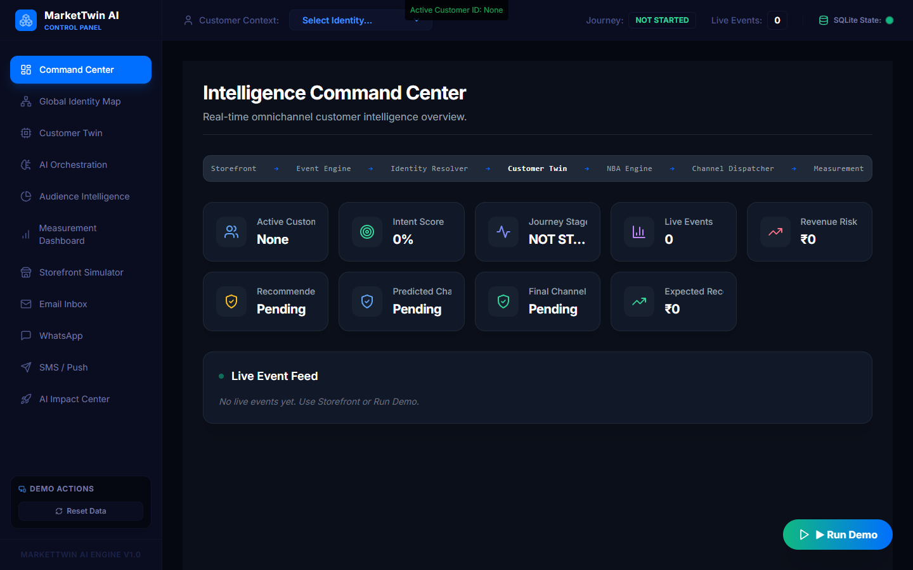

### Identity Map
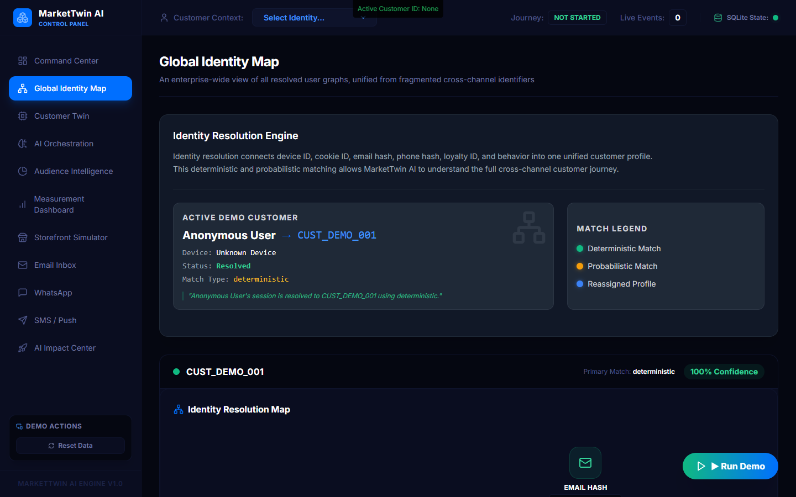

### Customer Twin
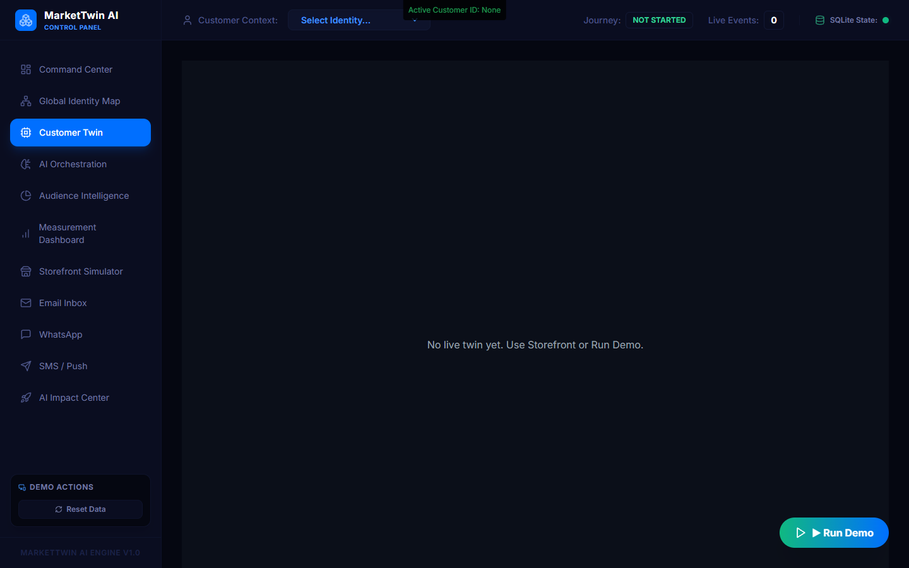

### AI Orchestration
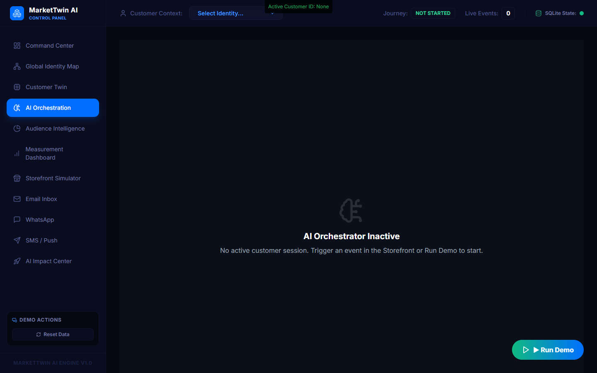

### Audience Intelligence
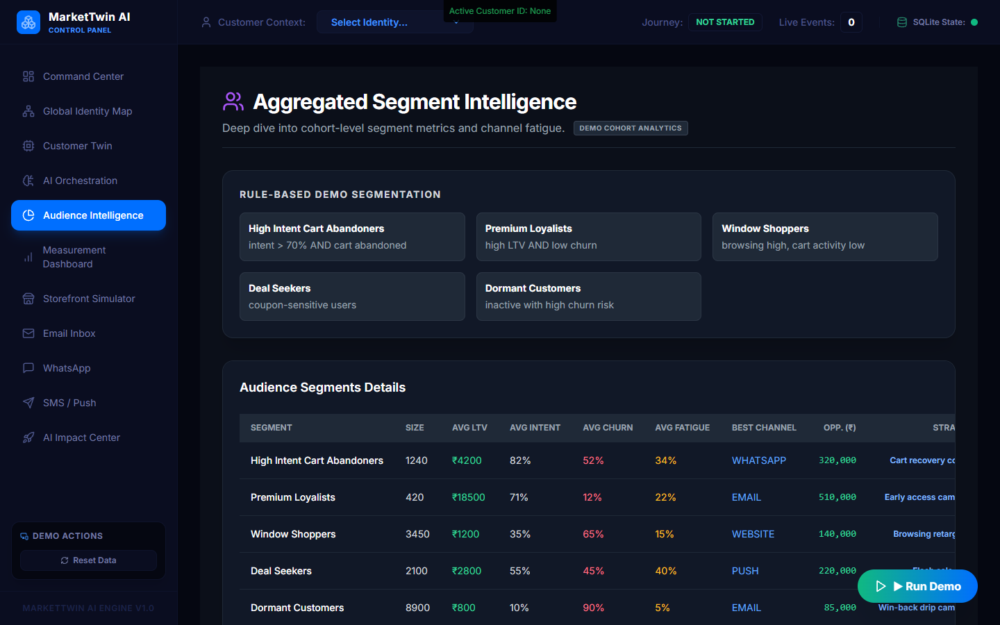

### Measurement Dashboard
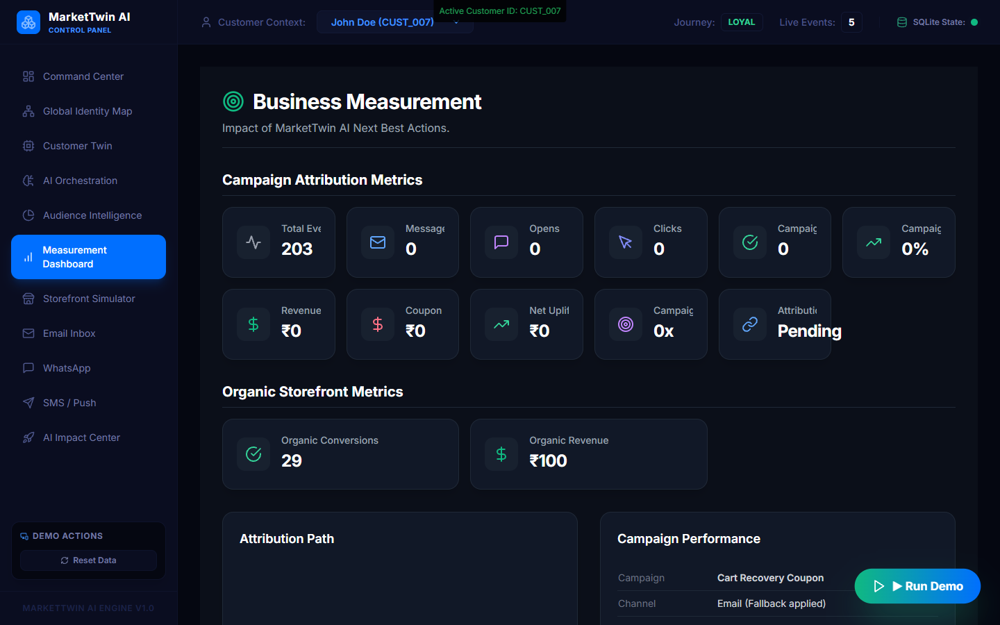

### Storefront Simulator
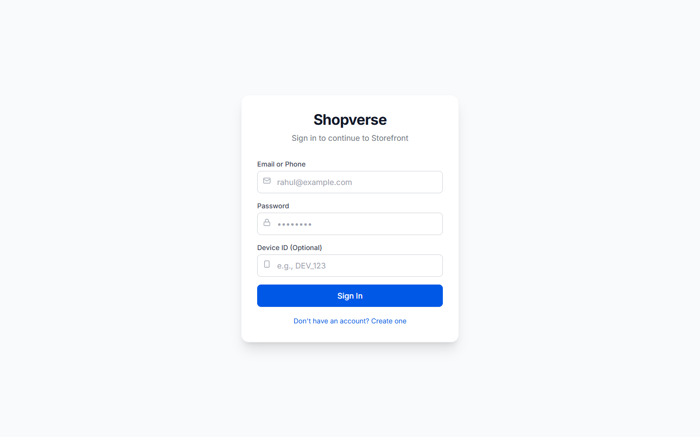

### Storefront Cart Products
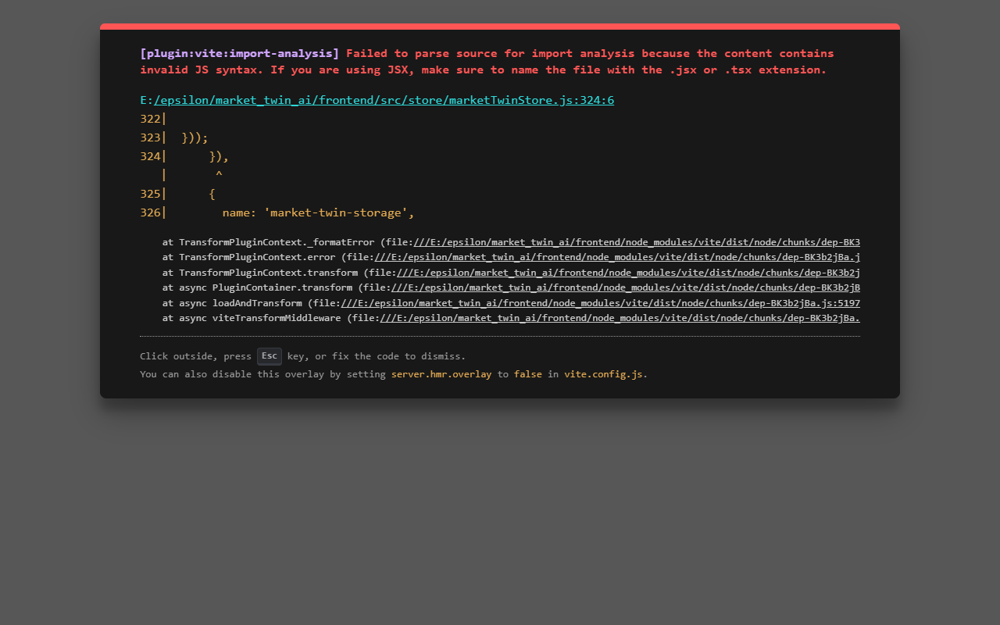

### Email Deliverability
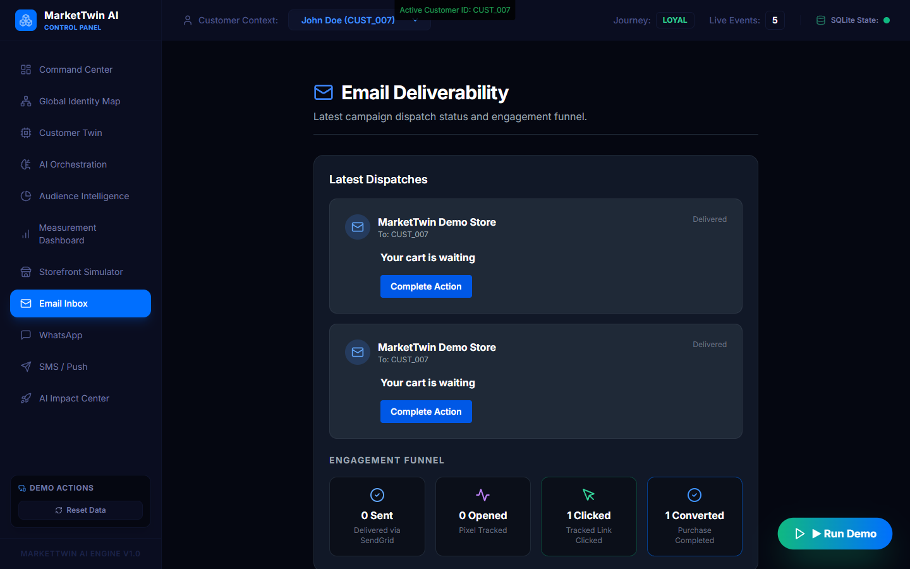

### WhatsApp Policy Gate
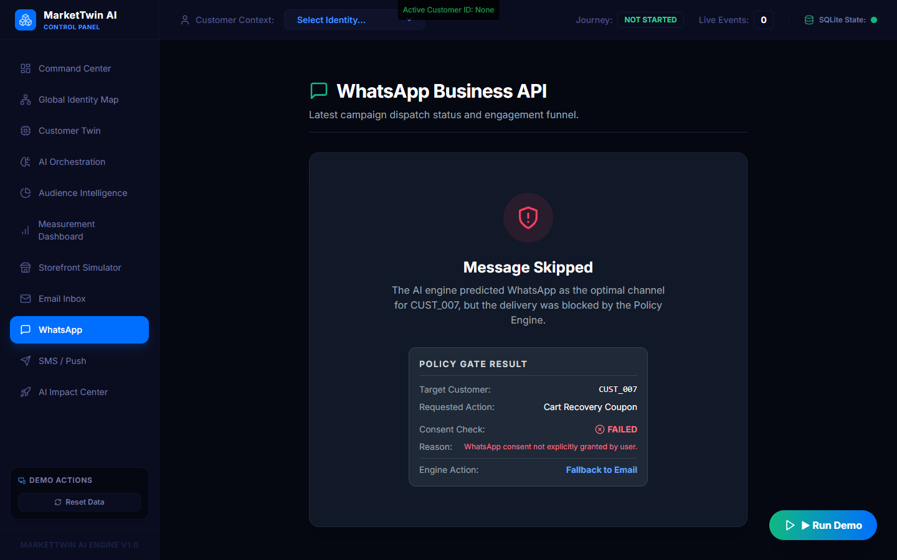

### SMS/Push Gateway
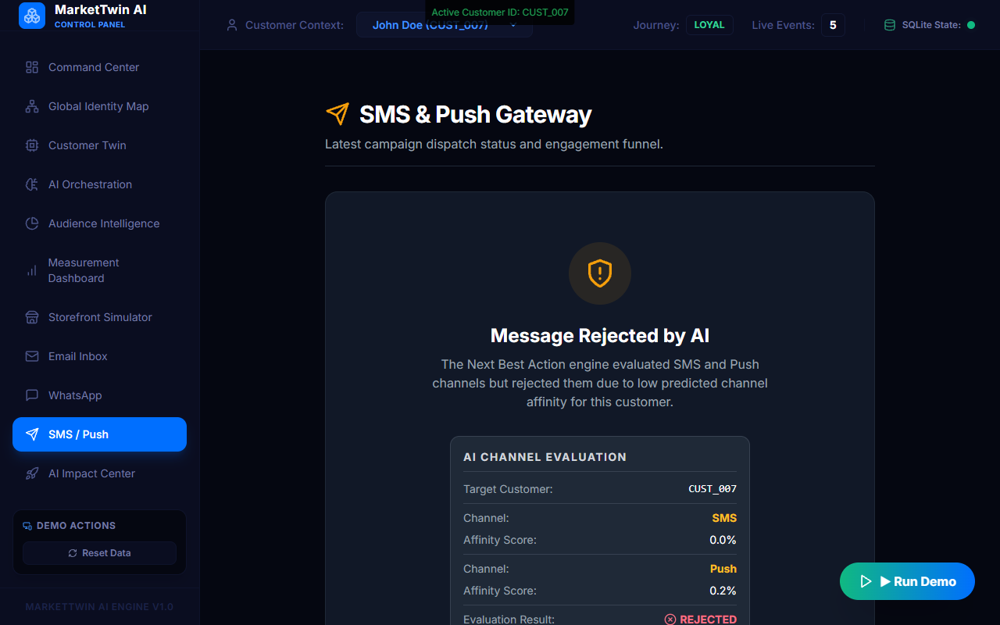

### AI Impact Center
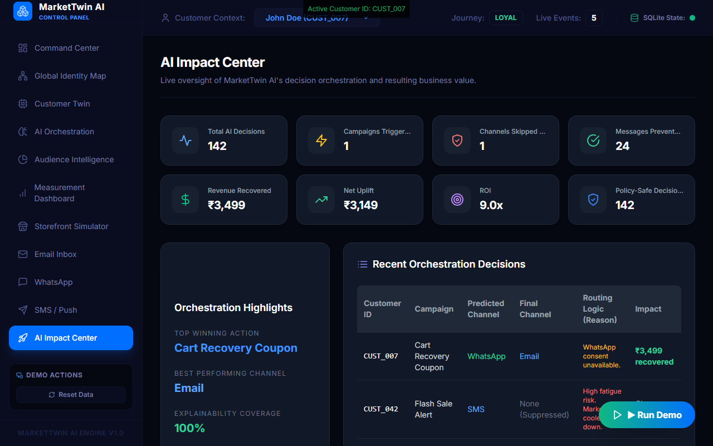

## Tech Stack
**Frontend:**
- React (v18)
- Vite
- TailwindCSS
- Zustand (State Management)
- Recharts
- Framer Motion

**Backend:**
- Python 3
- FastAPI
- Uvicorn
- SQLite (Database)
- SQLAlchemy (ORM)
- Pandas & NumPy
- Scikit-Learn

## Folder Structure
```text
market_twin_ai/
├── backend/
│   ├── app/
│   │   ├── api/
│   │   ├── core/
│   │   ├── database/
│   │   ├── models/
│   │   ├── services/
│   │   └── main.py
│   └── requirements.txt
├── frontend/
│   ├── src/
│   │   ├── api/
│   │   ├── components/
│   │   ├── pages/
│   │   ├── router/
│   │   └── store/
│   ├── package.json
│   └── vite.config.js
├── docs/
│   └── screenshots/
└── run.py
```

## Installation & Setup

1. **Clone the repository**
2. **Run the Backend (Python/FastAPI)**
   ```bash
   # Navigate to the root directory
   cd market_twin_ai
   
   # Create a virtual environment (optional but recommended)
   python -m venv .venv
   source .venv/bin/activate  # On Windows use: .venv\Scripts\activate
   
   # Install dependencies
   pip install -r backend/requirements.txt
   
   # Start the backend server
   python run.py
   ```
   *The backend will be available at http://localhost:8001*

3. **Run the Frontend (React/Vite)**
   ```bash
   # Open a new terminal and navigate to the frontend directory
   cd market_twin_ai/frontend
   
   # Install dependencies
   npm install
   
   # Start the development server
   npm run dev
   ```
   *The frontend will be available at http://localhost:3000*

## API Endpoints
Core backend capabilities are exposed via the following modular routers under the `/api` prefix:
- `GET /api/health` - System health check
- `POST /api/events` - Real-time event ingestion
- `GET /api/customers` - Fetch customer twins and identity data
- `POST /api/cart` - Cart management (add, abandon, purchase)
- `POST /api/predictive` - Access AI scoring and predictive models
- `GET /api/metrics` - Real-time measurement and ROI reporting
- `GET /api/messages` - Fetch channel-specific message history

## Measurement Logic
MarketTwin AI includes a defensible measurement engine to prove business value:
- **Campaign Attribution Path**: Tracks the precise journey from the AI's generated message to the final conversion event.
- **Organic vs. Attributed**: Separates organic purchases from those directly influenced by an AI intervention.
- **Net Uplift Calculation**: Calculates the difference in conversion probability before and after the AI action, translating that delta into incremental revenue.
- **ROI Calculation**: Measures the value of recovered carts against the simulated cost of channel delivery (e.g., WhatsApp cost vs Email cost).

## Originality & Hackathon Compliance
MarketTwin AI is a hackathon Minimum Viable Product (MVP) developed entirely during the hackathon timeline. It utilizes standard open-source libraries and frameworks (FastAPI, React, Scikit-Learn) to build a functional prototype. While it demonstrates advanced architectural concepts and predictive routing, it is built for demonstration purposes and is not yet production-ready.

## Team
**Team Members:**
1. Anshika Prashanth
2. Spandana M Raikar

## Demo Video / Presentation
**Demo Video:** [To be added]  
**Presentation:** docs/MarketTwinAI_Presentation.pptx

## Future Scope
- **Real Trained ML Models**: Transition from heuristic/probabilistic scoring to deep learning models trained on historical interaction data.
- **Graph-Based Identity Resolution**: Implement robust probabilistic graph databases to connect disparate browser fingerprints.
- **Real Channel APIs**: Integrate directly with Twilio (SMS/WhatsApp), SendGrid (Email), and APNS/FCM (Push).
- **Multi-Armed Bandit Optimization**: Continuously optimize the NBA engine using real-time exploration vs. exploitation metrics.
- **A/B Testing**: Native capabilities to run control groups against the AI orchestration engine.
- **Enterprise CDP Integrations**: Bidirectional sync with platforms like Segment, mParticle, or Adobe CDP.
- **Privacy/Consent Management**: Advanced GDPR/CCPA compliance engine with preference center synchronization.
